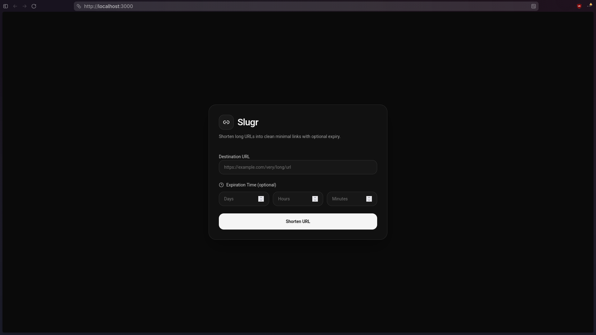

# Slugr Web

Frontend client for [Slugr](https://github.com/0xElsharawy/slugr), a URL shortener application. Provides a minimalist dark-themed UI for creating shortened URLs with optional expiration times.



## Tech Stack

| Frontend                                                              | Tooling                                                                                    |
| --------------------------------------------------------------------- | ------------------------------------------------------------------------------------------ |
| [Preact](https://preactjs.com/) – React-compatible UI framework (3kB) | [Vite](https://vitejs.dev/) – Build tool & dev server                                      |
| [TypeScript](https://www.typescriptlang.org/) – Strictly typed        | [pnpm](https://pnpm.io/) – Package manager                                                 |
| [Tailwind CSS v4](https://tailwindcss.com/) – Utility-first styling   | [@preact/preset-vite](https://github.com/preactjs/preset-vite) – Preact + Vite integration |

## Getting Started

```bash
pnpm install
pnpm dev        # starts dev server on http://localhost:3000
pnpm build      # type-check & build to dist/
pnpm preview    # preview production build
```

The frontend communicates with the backend API at `http://localhost:8080`. Start the [Slugr API](https://github.com/0xElsharawy/slugr/tree/main/api) first.

## Project Structure

```
src/
├── main.tsx                 # App entry point
├── app.tsx                  # Root component (state, form, popup)
├── index.css                # Global styles (Tailwind + Roboto font)
├── components/
│   ├── Header.tsx
│   ├── UrlForm.tsx
│   ├── ExpirationInputs.tsx
│   ├── ShortenedPopup.tsx
│   └── ui/
│       ├── Button.tsx
│       └── Input.tsx
└── assets/                  # Static images
```
